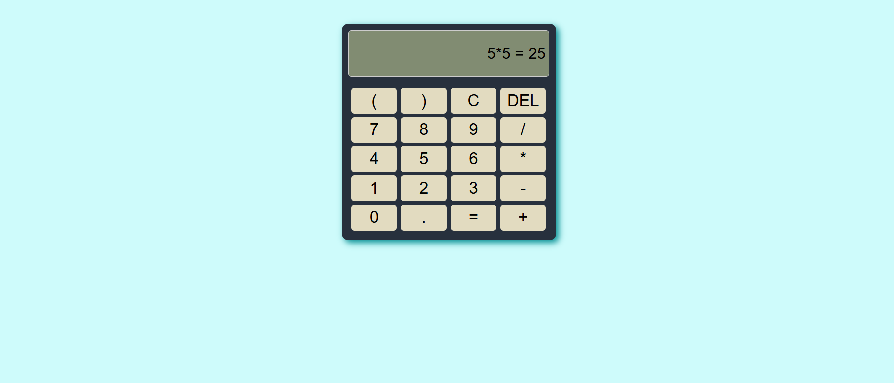

# Ex05-Image Carousel

## NAME : HARISELVAN S
## REG NO : 212224040103

## AIM
To create a Image Carousel using React 

## ALGORITHM
### STEP 1 Initial Setup:
Input: A list of images to display in the carousel.

Output: A component displaying the images with navigation controls (e.g., next/previous buttons).

### Step 2 State Management:
Use a state variable (currentIndex) to track the index of the current image displayed.

The carousel starts with the first image, so initialize currentIndex to 0.

### Step 3 Navigation Controls:
Next Image: When the "Next" button is clicked, increment currentIndex.

If currentIndex is at the end of the image list (last image), loop back to the first image using modulo:
currentIndex = (currentIndex + 1) % images.length;

Previous Image: When the "Previous" button is clicked, decrement currentIndex.

If currentIndex is at the beginning (first image), loop back to the last image:
currentIndex = (currentIndex - 1 + images.length) % images.length;

### Step 4 Displaying the Image:
The currentIndex determines which image is displayed.

Using the currentIndex, display the corresponding image from the images list.

### Step 5 Auto-Rotation:
Set an interval to automatically change the image after a set amount of time (e.g., 3 seconds).

Use setInterval to call the nextImage() function at regular intervals.

Clean up the interval when the component unmounts using clearInterval to prevent memory leaks.

## PROGRAM
```
app.js

import { useState } from 'react'
import reactLogo from './assets/react.svg'
import viteLogo from '/vite.svg'
import './App.css'

function App() {
  const [input, setInput] = useState("");   
  const [result, setResult] = useState(""); 

  const handleClick = (value) => {
    setInput((prev) => prev + value);
  };

  const handleClear = () => {
    setInput("");
    setResult("");
  };

  const handleDelete = () => {
    setInput((prev) => prev.slice(0, -1));
  };

  const handleEqual = () => {
    try {
      setResult(eval(input).toString());
    } catch (error) {
      setResult("Error");
    }
  };

  return (
    <>
      <div className="Calculator">
        <input 
          className="display" 
          id="display" 
          value={input + (result ? " = " + result : "")} 
          readOnly
        />
        <div className="buttons">
          <button onClick={() => handleClick("(")}>(</button>
          <button onClick={() => handleClick(")")}>)</button>
          <button onClick={handleClear}>C</button>
          <button onClick={handleDelete}>DEL</button>
          <button onClick={() => handleClick("7")}>7</button>
          <button onClick={() => handleClick("8")}>8</button>
          <button onClick={() => handleClick("9")}>9</button>
          <button onClick={() => handleClick("/")}>/</button>
          <button onClick={() => handleClick("4")}>4</button>
          <button onClick={() => handleClick("5")}>5</button>
          <button onClick={() => handleClick("6")}>6</button>
          <button onClick={() => handleClick("*")}>*</button>
          <button onClick={() => handleClick("1")}>1</button>
          <button onClick={() => handleClick("2")}>2</button>
          <button onClick={() => handleClick("3")}>3</button>
          <button onClick={() => handleClick("-")}>-</button>
          <button onClick={() => handleClick("0")}>0</button>
          <button onClick={() => handleClick(".")}>.</button>
          <button onClick={handleEqual}>=</button>
          <button onClick={() => handleClick("+")}>+</button>
        </div>
      </div>
    </>
  )
}

export default App

```
```
index.css
/* Reset and Font */
body {
    background-color: #cefbfb;
}

.Calculator {
    background-color: #27303d;
    width: 310px;
    border-radius: 10px;
    padding: 10px;
    box-shadow: 4px 4px 10px #0a9296;
    display: block;
    margin: auto;
}

.display {
    height: 60px;
    font-size: 24px;
    text-align: right;
    padding: 5px;
    background-color: #818c72;
    border: 1px solid #ccc;
    border-radius: 5px;
    margin-bottom: 12px;
    overflow: auto;
}

.buttons {
    display: grid;
    grid-template-columns: repeat(4, 3fr);
    margin: 5px;
    gap: 5px;
}

button {
    height: 40px;
    width: 70px;
    font-size: 25px;
    border: none;
    border-radius: 5px;
    cursor: pointer;
    background-color: #e2dbc0;
}

button:hover {
    background-color: #ca5858;
}
```

## OUTPUT




## RESULT
The program for creating Image Carousel using React is executed successfully.
